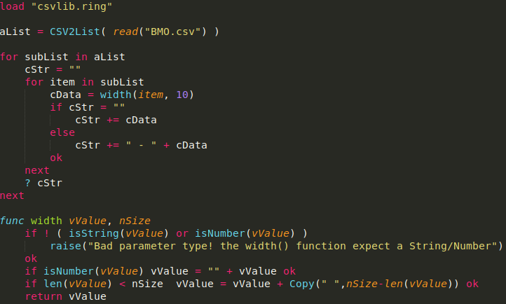
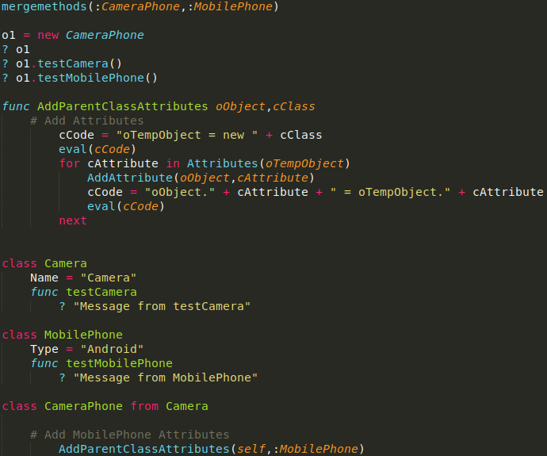
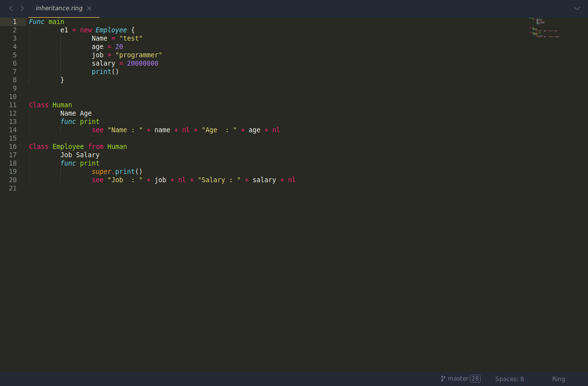

## Sublime Text Support for the [Ring](https://ring-lang.net/) Programming Language

This bundle provides [Ring](https://ring-lang.net/) syntax highlighting for Sublime Text.

## Features

- Support for keywords, comments, strings, etc.
- Support for keyword and function completions.

## Installation

1. Download or clone this repository.
```bash
git clone https://github.com/ysdragon/ring-sublime
```
2. Copy the `ring-sublime` folder into your Sublime Text `Packages` directory. You can find the `Packages` directory by going to `Preferences` > `Browse Packages...` in Sublime Text.
3. Restart Sublime Text.

## Usage

Once installed, Sublime Text should automatically detect `.ring`, `.rform` and `.rh` files and apply the syntax highlighting. If it does not, you can manually set the syntax by:

1. Opening a `.ring` file.
2. Going to `View` > `Syntax` > `Open all with current extension as...` > `Ring`.

## Screenshots





## License
This project is open-source and available under the MIT License. See the [LICENSE](https://github.com/ysdragon/ring-sublime/blob/master/LICENSE) file for more details.