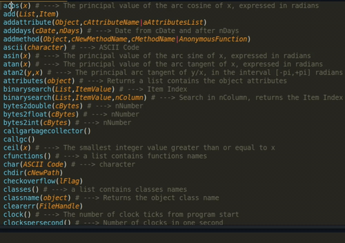
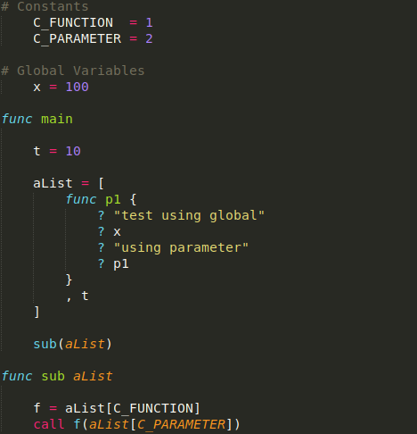

# Sublime Text Support for the Ring Programming Language

This bundle provides [Ring](https://ring-lang.net/) syntax highlighting for Sublime Text.

## Features

-   **Syntax Highlighting**: Complete support for Ring keywords, functions, strings, numbers, and operators.
-   **Code Completion**: Suggestions for keywords and functions.
-   **Interactive Tooltips**: Hover over any function to get instant documentation, including syntax and code examples.
-   **Build System Integration**: Run your Ring scripts (`.ring` files) directly from Sublime Text using the built-in build system (`Ctrl+B`).

## Screenshots

## Installation

1. Open the Command Palette in Sublime Text by pressing `Ctrl+Shift+P` (Windows/Linux) or `Cmd+Shift+P` (macOS).
2. Type `Package Control: Install Package` and select from the dropdown list.
3. Type `Ring` in the search box and select the `Ring` package from the list.

## Usage

After installation, the plugin automatically handles `.ring`, `.rform`, and `.rh` files.

### Syntax Highlighting

If syntax highlighting is not applied automatically, you can set it manually:
1.  Open a `.ring` file.
2.  Go to `View > Syntax > Ring`.

## Contributing

Contributions are welcome! If you find a bug or have a feature request, please open an issue on the [GitHub repository](https://github.com/ysdragon/ring-sublime/issues). If you want to contribute code, please fork the repository and submit a pull request.

## License

This project is licensed under the MIT License. See the [LICENSE](LICENSE) file for details.